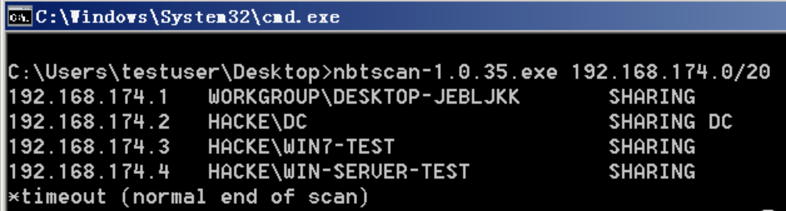
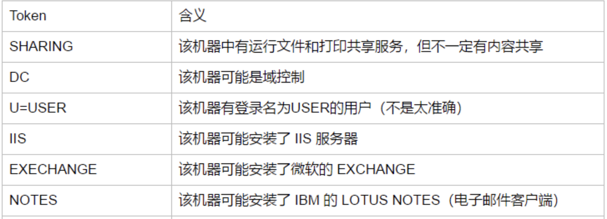
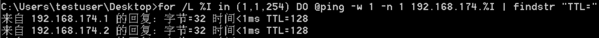

# 内网信息收集

## Windows

### **收集本机信息**

当渗透测试人员成功控制一台机器后，其内网结构如何、这台机器是什么角色的、使用机器的人是什么角色的、机器上安装的是什么杀毒软件、机器是通过什么方式上网的、机器是笔记本还是台式机等，都需要通过信息收集来获取。

本机信息包括主机的系统、权限、内网分配P地址段、安装的软件杀毒、端口、服务、补丁更新频率、网络连接信息、共享、会话等。如果是域内主机，系统、软件、补丁、服务、杀毒一般都是批量安装的。通过收集本机的相关信息，可以进一步了解整个域的操作系统版本、软件、补丁、用户命名方式等。

#### 基础命令

| 命令                                                         | 功能                             | 备注                              |
| :----------------------------------------------------------- | :------------------------------- | --------------------------------- |
| `ipconfig /all`                                              | 查询网络配置信息                 |                                   |
| systeminfo \| findstr /B /C:"OS 名称" /C:"OS 版本"           | 查询操作系统版本-中文            |                                   |
| systeminfo \| findstr /B /C:"OS Name" /C:"OS Version"        | 查询操作系统版本-英文            |                                   |
| echo %PROCESSOR_ARCHITECTURE%                                | 查看系统体系结构                 |                                   |
| wmic product get name,version                                | 安装软件版本信息                 |                                   |
| powershell "Get-WmiObject -class Win32_Product \| Select-Object -Property name,version" | 收集软件版本信息                 |                                   |
| wmic service list brief                                      | 查询本机服务信息                 |                                   |
| `tasklist /svc`                                              | 查询进程列表信息                 |                                   |
| wmic startup get command,caption                             | 查看启动程序信息                 |                                   |
| schtasks /query /fo  LIST /v                                 | 查看计划任务信息                 |                                   |
| net statistics workstation                                   | 查看主机开机时间                 |                                   |
| net user                                                     | 查询用户列表信息                 |                                   |
| net localgroup administrators                                | 获取本地管理员（通常含有域用户） |                                   |
| query user \|\| qwinsta                                      | 查看当前在线用户信息             |                                   |
| net session                                                  | 查客户端会话信息(管理员权限)     |                                   |
| `netstat -ano`                                               | 查询端口列表信息                 |                                   |
| `Systeminfo`                                                 | 查询补丁列表信息                 |                                   |
| wmic qfe get Caption,Description,HotFixID,InstalledOn        | wmic来识别安装在系统中的补丁     |                                   |
| `net share`                                                  | 查看本机共享信息                 |                                   |
| wmic share get name,path,status                              | wmic查找共享                     |                                   |
| route print                                                  | 查询路由和缓存表                 |                                   |
| arp -a                                                       | 查询arp                          |                                   |
| netsh firewall show config                                   | 查询防火墙配置                   |                                   |
| netsh firewall set opmode disable                            | 关闭防火墙                       | Windows Server 2003系统及以前版本 |
| netsh firewall add allowedprogram c:\nc.exe "allow nc" enable | 修改防火墙配置                   | Windows Server 2003系统及之前版本 |
| netsh advfirewall set allprofiles state off                  | 关闭防火墙                       | Windows server 2003之后系统版本   |
| netsh advfirewall firewall add rule name="pass nc" dir=in action=allow program="C: \nc.exe" | 允许指定程序连入                 | Windows server 2003 之后系统版本  |
| netsh advfirewall firewall add rule name="Allow nc" dir=out action=allow program="C: \nc.exe" | 允许指定程序连出                 | Windows server 2003 之后系统版本  |
| netsh advfirewall firewall add rule name="Remote Desktop" protocol=TCP dir=in localport=3389 action=allow | 允许 3389 端口放行               | Windows server 2003 之后系统版本  |
| netsh advfirewall set currentprofile logging filename "C:\windows\temp\fw.log" | 自定义防火墙日志存储位置         |                                   |
| REG QUERY "HKEY_LOCAL_MACHINE\SYSTEM\CurrentControlSet\Control\Terminal Server\WinStations\RDP-Tcp" /V PortNumber | 查看远程连接端口                 | 端口为0xd3d，转换后为3389         |
| cmdkey /l                                                    | 远程桌面连接历史记录             |                                   |
| net localgroup administrators                                | 查询本地管理员组用户             |                                   |

#### 域

```cmd
whoami          #查看当前权限                                                         
whoami /all     #获取域 SID                                                            
ipconfig /all   #判断是否有域,反向解析查询命令nslookup来解析域名的IP地址                   
Systeminfo      #查看系统详细信息                                                                
net time /domain #判断主域 
	  #1.存在域，但当前用户不是域用户，提示说明权限不够。
	  #2.存在域，并且当前用户是域用户。
	  #3.当前网络环境为工作组，不存在域。                                                   
```

##### 探测内网存活

- 利用NetBIOS快速探测内网



显示结果的第一列为IP地址，第二列是机器名和所在域名，最后一列是关于机器所开启的服务的列表，具体含义如下表所示：



- 利用 ICMP 协议快速探测内网

```cmd
for /L %I in (1,1,254) DO @ping -w 1 -n 1 192.168.1.%I | findstr "TTL="
```



- 利用VBS脚本

```vbs
strSubNet = "192.168.1."
Set objFSO= CreateObject("Scripting.FileSystemObject")
Set objTS = objfso.CreateTextFile("C:\Windows\Temp\Result.txt")
For i = 1 To 254  
strComputer = strSubNet & i
blnResult = Ping(strComputer)
If blnResult = True Then  
objTS.WriteLine strComputer & " is alived ! :) "  
End If  
Next       

objTS.Close
WScript.Echo "All Ping Scan , All Done ! :) "    
Function Ping(strComputer)
Set objWMIService = GetObject("winmgmts:\\.\root\cimv2")
Set colItems = objWMIService.ExecQuery("Select * From Win32_PingStatus Where Address='" & strComputer & "'")
For Each objItem In colItems
Select case objItem.StatusCode
Case 0  
    Ping = True 
Case Else  
Ping = False  
End select  
Exit For  
Next  
End Function
```

在使用时，需要修改IP地址段，之后输入如下命令，添加参数/b 表示置于后台运行:

```cmd
cscript c:\windows\temp\1.vbs
```

##### 扫描域内端口


##### 查询域

```cmd
net view /domain
net view /domain:XXX    #查询此域内所有计算机
net group /domain       #查询域内所有用户组列表
net group "domain computers" /domain    #查询所有域成员计算机列表
nltest /domain_trusts		#获取域信任列表
nltest /DCLIST:xxx			#查看域内控制器的机器名
Nslookup -type=SRV _ldap._tcp	#查看域控制器的主机名
net time /domain				#查看当前时间,一般时间服务器为主域控制器
net group "Domain Controllers" /domain		#查看域控制器组
```

系统自带的常见组如下:

- Domain Admins：域管理员组。
- Domain Computers：域内机器。
- Domain Controllers：域控制器。
- Domain Guest：域访客组，权限较低。
- Domain Users：域用户。
- Enterprise Admins：企业系统管理员用户。

##### 获取域内用户详细信息

```cmd
wmic useraccount get /all
```

- 查看存在的用户

```cmd
dsquery user

dsquery computer #查找目录中的计算机。
dsquery contact #查找目录中的联系人。
dsquery subnet #查找目录中的子网。
dsquery group #查找目录中的组。
dsquery ou #查找目录中的组织单位。
dsquery site # 查找目录中的站点。
dsquery server # 查找目录中的域控制器。
dsquery user #查找目录中的用户。
dsquery quota # 查找目录中的配额。
dsquery partition # 查找目录中的分区。
dsquery * # 用通用的 LDAP 查询查找目录中的任何对象。
dsquery computer domainroot -limit 65535 && net group “domain computers” /domain  #列出该域内所有机器名
dsquery user domainroot -limit 65535 && net user /domain #列出该域内所有用户名
dsquery subnet #列出该域内网段划分
dsquery group && net group /domain #列出该域内分组
dsquery ou #列出该域内组织单位
dsquery server && net time /domain #列出该域内域控制器
```

### 自动收集信息

- 下载后直接运行脚本： `wmic_info.bat`

[http://www.fuzzysecurity.com/scripts/files/wmic_info.rar]

 [wmic_info.rar](tools/wmic_info.rar) 

